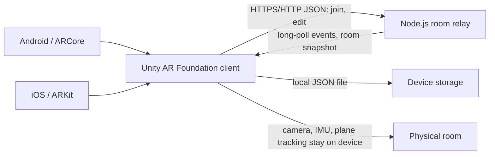
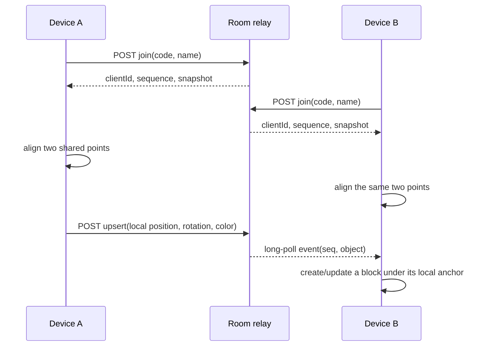

# Technical Architecture

## Components

The client uses AR Foundation for camera tracking, horizontal-plane detection, and local scene anchoring. The server does not receive camera frames or room meshes. Project files are saved only under `Application.persistentDataPath`; the server keeps each room's current state in process memory.

## Shared Coordinate System

ARCore and ARKit maintain separate local world coordinate systems, so sending a phone's raw `Transform.position` would not place an object correctly on another phone. The MVP handles this through manual alignment: each participant points at the same physical origin on the floor and a second point that defines the forward axis. The client creates an `ARAnchor` at the origin and stores object transforms relative to that anchor. The server relays those local coordinates.

Participants must identify the same points carefully. This approach does not align devices as accurately or automatically as ARCore Cloud Anchors or a shared ARKit world map. A provider-based shared-anchor workflow remains future work.

## Event Flow

Each change receives an increasing sequence number. Clients long-poll from their last processed sequence. If a cursor falls outside the retained event history, the server returns a full snapshot. Polling keeps the transport dependency-free, but adds request overhead and latency compared with a purpose-built networking service such as Photon or Unity Netcode.

## Limits and Security

- The relay caps a room at 200 objects and 32 members, limits the process to 500 rooms and 4,096 retained events per room, and removes rooms after 12 hours without activity.
- Anyone who knows a room code can edit its state. A code is an invitation, not authentication.
- The server validates JSON payloads, transform ranges, quaternion magnitude, colors, room membership, object limits, and a per-member limit of 40 operations per second.
- The client retries polling with backoff and rejoins if its room expires. A server restart clears room state because no database is configured.
- Use HTTPS for remote demos. The prototype has no accounts, object ownership, server-side TLS termination, or durable storage.
- Do not commit server secrets. Camera data and AR mapping stay on-device; display names, room codes, and block transforms are sent to the relay.

## MVP Performance Budget

The client displays FPS, AR session state, total tracking-loss time, block count, and approximate request round-trip time. The local limit is 200 blocks. The gravity action enables at most eight dynamic rigidbodies at once; physics updates are limited to four objects every 200 ms. These are prototype limits, not device performance measurements.
