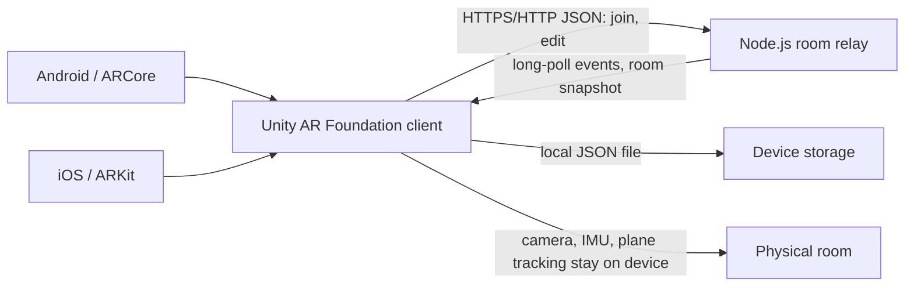
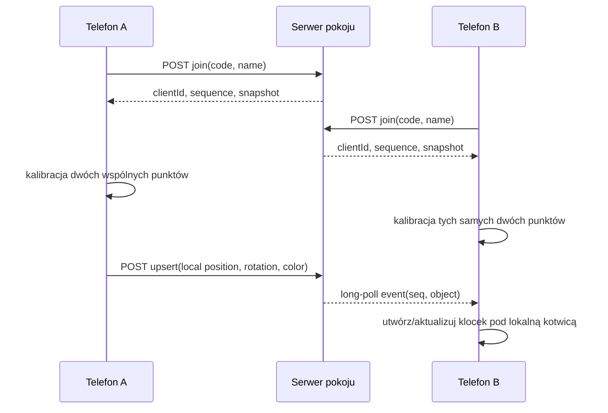

# Architektura techniczna

## Komponenty

Klient używa AR Foundation do śledzenia kamery, wykrywania poziomych płaszczyzn i kotwiczenia lokalnej sceny. Serwer nie otrzymuje klatek z kamery ani siatek pomieszczenia. Zapis projektu trafia wyłącznie do `Application.persistentDataPath`; serwer utrzymuje bieżący stan pokoju w pamięci.

## Wspólny układ współrzędnych

ARCore i ARKit prowadzą własne lokalne układy świata, więc wysłanie surowych współrzędnych `Transform.position` z jednego telefonu nie ustawi obiektu poprawnie na drugim. MVP rozwiązuje to podczas kalibracji: każdy uczestnik wskazuje fizycznie ten sam początek na podłodze i drugi punkt określający kierunek osi Z. Klient tworzy `ARAnchor` w początku układu, a pozycje obiektów zapisuje jako lokalne transformacje względem tej kotwicy. Serwer przesyła właśnie te współrzędne lokalne.

Ta procedura wymaga starannego wskazania tych samych punktów przez uczestników. Nie zapewnia automatycznego zbiegu układów tak dokładnego jak ARCore Cloud Anchors lub współdzielona mapa ARKit; integracja dostawcy kotwic pozostaje kolejnym etapem.

## Przepływ zdarzeń

Każda modyfikacja otrzymuje rosnący numer sekwencji. Klient pobiera zdarzenia long-pollingiem, zaczynając od ostatniej obsłużonej sekwencji. Jeżeli jego kursor wypadnie poza retencję historii, serwer zwraca pełny snapshot. Polling daje prosty transport bez dodatkowych pakietów, ale dodaje obciążenie i opóźnienie w porównaniu z Photon/Netcode.

## Ograniczenia i ochrona

- Serwer przechowuje maksymalnie 200 obiektów i 32 członków w pokoju, 500 aktywnych pokoi i 4096 zdarzeń na pokój; usuwa pokój po 12 godzinach bez aktywności.
- Zmieniać stan może każdy, kto zna kod pokoju. Kod działa jako zaproszenie, ale nie zastępuje uwierzytelniania.
- Serwer weryfikuje format JSON, zakres pozycji i kwaternionu, kolor, limit obiektów, członkostwo oraz 40 operacji na sekundę na uczestnika.
- Klient ponawia polling z rosnącym odstępem i dołącza ponownie po utracie pokoju. Po restarcie serwera dane pokoju przepadają, bo nie ma bazy danych.
- Do zdalnego demo wystaw wyłącznie HTTPS. Prototyp nie ma kont, autoryzacji właściciela klocka, TLS po stronie Node ani trwałego storage.
- Nie umieszczaj sekretów serwera w repozytorium. Kamera i mapowanie AR działają lokalnie; nazwa użytkownika, kod pokoju i transformacje są wysyłane do serwera.

## Budżet wydajności MVP

Klient pokazuje bieżący FPS, stan sesji AR, sumaryczny czas utraty śledzenia, liczbę klocków i przybliżony RTT żądań. Lokalny limit to 200 klocków, a przycisk fizyki uruchamia maksymalnie osiem symulacji dynamicznych naraz; aktualizacje fizyki są ograniczone do czterech obiektów co 200 ms. Są to ograniczenia prototypu, a nie wyniki pomiarów urządzeń.
